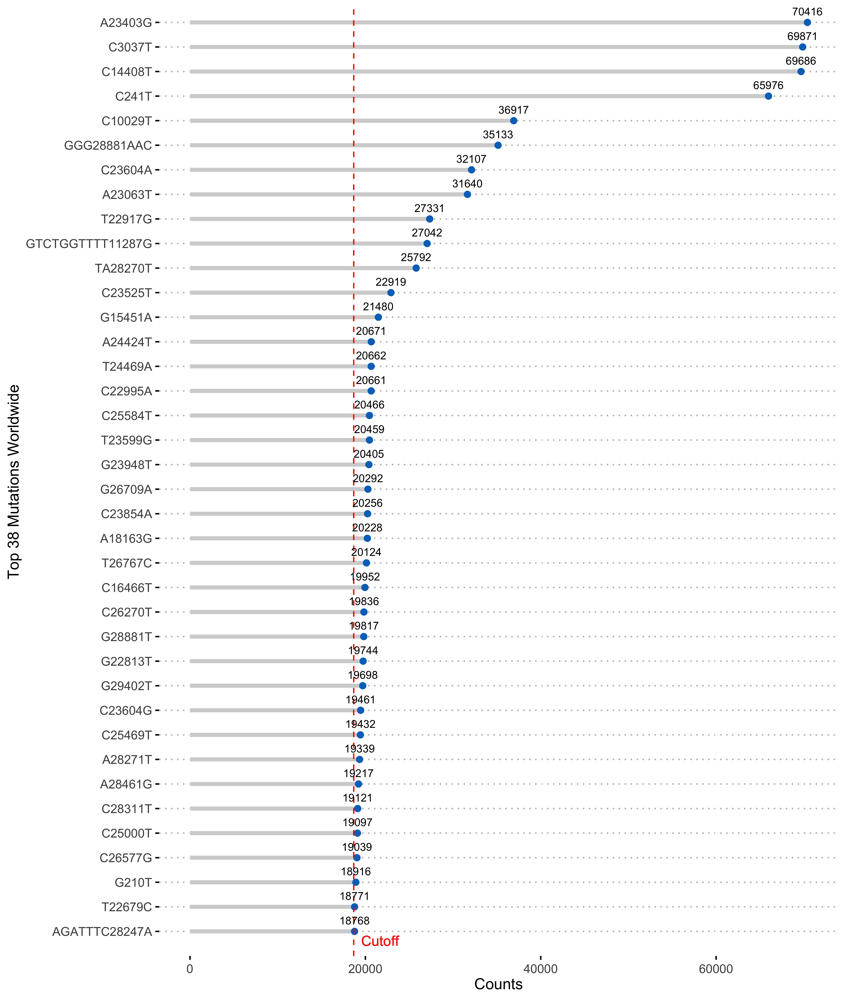

# MOSAIC (Mutation Organizing through Synergistic Analysis of Integrated Clinical data)
### Authors: Jingxue Feng (jingxuef@sfu.ca), Jie Wang (wangjiew@sfu.ca), Jiarui Zhang (jiaruiz@sfu.ca), Liangliang Wang (lwa68@sfu.ca)

## About
MOSAIC (Mutation Organizing through Synergistic Analysis of Integrated Clinical data), an innovative pipeline that incorporates both genome sequencing and clinical data to group SARS-CoV-2 mutations that
share similar relationship with clinical features. The MOSAIC pipeline is shown below.
<p align="center">

</p>

## Data Input
All data up to the cut-off date of December 31, 2022, were retrieved from the [GISAID](https://gisaid.org/) database.   

**sequence.fasta**: the complete SARS-CoV-2 genomes for patients
<p align="center">
  
</p>

**clinicaldata.tsv**: the clinical features for patients
<p align="center">
  
</p>

**reference.gbk**: the reference SARS-CoV-2 genome 
<p align="center">

</p>

## Stages

### Selection of Mutations
The [Snippy tool](https://github.com/tseemann/snippy) was utilized to identify unique mutation events. In order to avoid rare-event bias in logistic regression, we use 50% of the number
of unique mutation events as the cutoff to select the most frequent mutations for further cluster analysis. The top 38 mutations were finally chosen for cluster analysis.
<p align="center">
  
</p>

### Clustering of Logistic Regression Model (CLRM)
```math
y_{n,m} | Z_{m,k}=1 \sim \text{Bernoulli}(\pi_{n, k})  \text{ with } \pi_{n, k} = \frac{\exp( \mathbf{x}_{n}^{\top} \boldsymbol{\beta}_{k})}{1 + \exp( \mathbf{x}_{n}^{\top} \boldsymbol{\beta}_{k})}, 
```
```math
\mathbf{Z}_m \sim \text{Multinomial}(\boldsymbol{\lambda}) \text{ with } \boldsymbol{\lambda} = [\lambda_{1}, \ldots, \lambda_{K}]^{\top}, \lambda_{k} \ge 0 \text{ and } \sum_{k=1}^K \lambda_{k} = 1.
```
- $y_{n,m}$ denote whether mutation m is present (1) or absent (0) in the genomic sequence of the n-th individual;
- $Z_{m,k}$ indicates if mutation m belongs to cluster k;
- $\pi_{n, k}$ indicates the probability that mutation m exists in the n-th genome sequence, given that we know the clinical features of individual n and the mutation m belongs to
cluster k;
- $\mathbf{x}_{n}$ is a $(D+1) \times 1$ vector representing the intercept and covariates associated with n-th patient;
- $\boldsymbol{\beta}_k$ is a $(D+1) \times 1$ vector storing the logistic regression intercept and coefficients associated with mutations in cluster $k$.

### Bayesian Inference of CLRM
In CLRM, the indicator matrix $\mathbf{Y}$ is observed, the latent variable $\mathbf{Z}$,  the parameters $\boldsymbol{\beta}$ and $\boldsymbol{\lambda}$ are unknown. For brevity, we omit the dimensions of variables. Bayesian inference depends on the following posterior distribution
```math
    p(\boldsymbol{\beta}, \boldsymbol{\lambda}|\mathbf{Z},\mathbf{Y}) \propto  
    p(\boldsymbol{\beta}, \boldsymbol{\lambda}, \mathbf{Z}, \mathbf{Y})  = p(\mathbf{Y}, \mathbf{Z}|\boldsymbol{\beta},\boldsymbol{\lambda})p(\boldsymbol{\beta} | \boldsymbol{\mu}, \boldsymbol{\Sigma}) p(\boldsymbol{\mu}) p(\boldsymbol{\lambda}),
```
where the complete likelihood 
```math
p(\mathbf{Y}, \mathbf{Z}|\boldsymbol{\beta},\boldsymbol{\lambda})
=p(\mathbf{Y}|\mathbf{Z},\boldsymbol{\beta})p(\mathbf{Z}|\boldsymbol{\lambda}) 
```
and $p(\boldsymbol{\beta} | \boldsymbol{\mu}, \boldsymbol{\Sigma})p(\boldsymbol{\lambda})$ are priors for $\boldsymbol{\beta}$ and $\boldsymbol{\lambda}$,  $p(\boldsymbol{\mu} | \boldsymbol{m}_0, \boldsymbol{\Sigma}_0)$ is the hyperprior for the prior means of $\boldsymbol{\beta}$.

Please refer to [MOSAIC/Code/mixture_adaptive_gibbs_sampler.R](https://github.com/grace84/MOSAIC/blob/main/Code/mixture_adaptive_gibbs_sampler.R) for the detailed implementation of adaptive Metropolis-within-Gibbs sampler. The parameter estimation in simulation study and real data analysis is performed based on this adaptive Metropolis-within-Gibbs sampler.

## Data Output
1. Cluster membership of each mutation;
2. Within-cluster regression coefficients, indicating the cluster-level relationship with clinical features.
