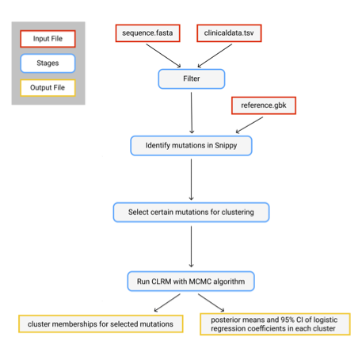

# MOSAIC (Mutation Organizing through Synergistic Analysis of Integrated Clinical data)
### Authors: Jingxue Feng (jingxuef@sfu.ca), Jie Wang (wangjiew@sfu.ca), Jiarui Zhang (jiaruiz@sfu.ca), Liangliang Wang (lwa68@sfu.ca)

## About
MOSAIC (Mutation Organizing through Synergistic Analysis of Integrated Clinical data), an innovative pipeline that incorporates both genome sequencing and clinical data to group SARS-CoV-2 mutations that
share similar relationship with clinical features. The pipeline is shown below

<p align="center">
  
</p>


## Clustering of Logistic Regression Model
```math
y_{n,m} | Z_{m,k}=1 \sim \text{Bernoulli}(\pi_{n, k})  \text{ with } \pi_{n, k} = \frac{\exp( \mathbf{x}_{n}^{\top} \boldsymbol{\beta}_{k})}{1 + \exp( \mathbf{x}_{n}^{\top} \boldsymbol{\beta}_{k})}, 
```
```math
\mathbf{Z}_m \sim \text{Multinomial}(\boldsymbol{\lambda}_m) \text{ with } \boldsymbol{\lambda}_m = [\lambda_{m,1}, \ldots, \lambda_{m,K}]^{\top}, \lambda_{m,k} \ge 0 \text{ and } \sum_{k=1}^K \lambda_{m,k} = 1.
```
- $y_{n,m}$ denote whether mutation m is present (1) or absent (0) in the genomic sequence of the n-th individual;
- $Z_{m,k}$ indicates if mutation m belongs to cluster k;
- $\pi_{n, k}$ indicates the probability that mutation m exists in the n-th genome sequence, given that we know the clinical features of individual n and the mutation m belongs to
cluster k;
- $\mathbf{x}_{n}$ is a $(D+1) \times 1$ vector representing the intercept and covariates associated with n-th patient;
- $\boldsymbol{\beta}_k$ is a $(D+1) \times 1$ vector storing the logistic regression intercept and coefficients associated with mutations in cluster $k$.
